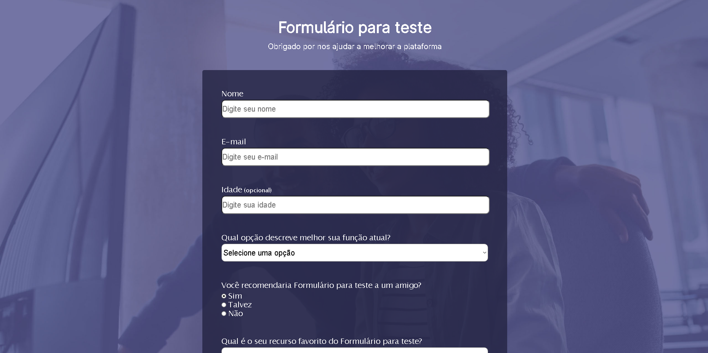

  

  Projeto pessoal de um formulário

  

  <a href="#clipboard-sobre-o-projeto">Sobre o Projeto</a>&nbsp;&nbsp;&nbsp;|&nbsp;&nbsp;&nbsp;
  <a href="#computer-tecnologias-utilizadas">Tecnologias</a>&nbsp;&nbsp;&nbsp;|&nbsp;&nbsp;&nbsp;
  <a href="#closed-book-licença">Licença</a>

## :clipboard: Sobre o Projeto

Formulário para feedback de um possível cliente ou aluno de escolas e universidades. Ele também vem acompanhado de um design moderno e totalmente flexível para qualquer tipo de aparelho!

## :computer: Tecnologias utilizadas

O projeto foi desenvolvido utilizando as seguintes tecnologias:

- HTML
- CSS

## :closed_book: Licença

Esse projeto está sob a licença MIT.
